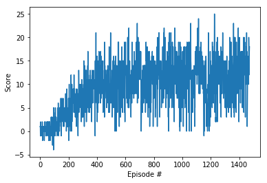

# DQN agent plays the Banana Game

This project was completed as a requirement to pass the Deep Reinforcement Learning Nanodegree at Udacity.

The Banana game is simple. Collect yellow bananas and avoid blue ones. The player has 4 actions (left, right, up, down). A score of +1 is awarded for every yellow bananna and -1 for every blue one collected. The goal of this project was to design an agent that would learn the game and achieve an average score of over 13.


I completed the requirements by using a Deep Q algorythm similar to the one used by Deep Mind to play Atari games at super human performance. The key features of this algorithm is the application of:

* experience replay
* and fixed-Q targets

The neural net used to solve the problem is far simpler than Deep-Minds becasuse the state-space is simpler with only a vector of 37 values compared to a 84x84x4 matrix representing the Atari game space. My solution worked using a dense-net with only 3 fully-connected layers with 64 nodes in the hidden layer.

The jupyter notebook sets up the environment and trains the agent. The learning algo is in the dqn_agent.py file, and the neural network architecture in the model.py file. The trained model-weights is saved in the winning_agent.pth file. 


## Requirements to run locally

Note: (*For Windows users*) The ML-Agents toolkit supports Windows 10. While it might be possible to run the ML-Agents toolkit using other versions of Windows, it has not been tested on other versions. Furthermore, the ML-Agents toolkit has not been tested on a Windows VM such as Bootcamp or Parallels.

To set up your python environment to run the code in this repository, follow the instructions below.

1. Create (and activate) a new environment with Python 3.6.

   - **Linux** or **Mac**:

   ```
   conda create --name bananna python=3.6
   source activate bananna
   conda install jupyter notebook
   ```

   - **Windows**:

   ```
   conda create --name bananna python=3.6 
   activate bananna
   conda install jupyter notebook
   ```

2. Install required packages into the environment with

   ```
   pip install ./python
   ```
   
3. You will **not** need to install Unity - this is because Udacity has already built the environment for you, and you can download it from one of the links below. You need only select the environment that matches your operating system:

   - Linux: [click here](https://s3-us-west-1.amazonaws.com/udacity-drlnd/P1/Banana/Banana_Linux.zip)
   - Mac OSX: [click here](https://s3-us-west-1.amazonaws.com/udacity-drlnd/P1/Banana/Banana.app.zip)
   - Windows (32-bit): [click here](https://s3-us-west-1.amazonaws.com/udacity-drlnd/P1/Banana/Banana_Windows_x86.zip)
   - Windows (64-bit): [click here](https://s3-us-west-1.amazonaws.com/udacity-drlnd/P1/Banana/Banana_Windows_x86_64.zip)

   Then, place the file in this project folder, and unzip (or decompress) the file.

   (*For Windows users*) Check out [this link](https://support.microsoft.com/en-us/help/827218/how-to-determine-whether-a-computer-is-running-a-32-bit-version-or-64) if you need help with determining if your computer is running a 32-bit version or 64-bit version of the Windows operating system.

   (*For AWS*) If you'd like to train the agent on AWS (and have not [enabled a virtual screen](https://github.com/Unity-Technologies/ml-agents/blob/master/docs/Training-on-Amazon-Web-Service.md)), then please use [this link](https://s3-us-west-1.amazonaws.com/udacity-drlnd/P1/Banana/Banana_Linux_NoVis.zip) to obtain the "headless" version of the environment. You will **not** be able to watch the agent without enabling a virtual screen, but you will be able to train the agent. (*To watch the agent, you should follow the instructions to [enable a virtual screen](https://github.com/Unity-Technologies/ml-agents/blob/master/docs/Training-on-Amazon-Web-Service.md), and then download the environment for the **Linux** operating system above.*)

4. Open notebook with `jupyter notebook`

5. Open Navigation.ipynb and run the code cells


> You may experience an unstable Kernel as I did. I have not yet found what is causing this. I just keep re-freshing the environment until it works.


## How the agent learns

This explaination assumes the reader has a general working knowledge of neural networks, and Markov Decision Processes, specifically the SARSA-max or Q-Learning algorythm.


Instead of the discrete Q-table used in Q-Learning, we replace this with a neural network which enables us to work in continuous state spaces, and also to model a non-linear action-value function. 


If you've studied neural networks, you are familiar with the pixel to label mapping, thats used to categorize images. Instead we use the network to map a given state to a list of expected reward values for all possible actions. This replaces our Q table. 

Originally when  researchers implemented this, the learning was unstable and it was difficult to converge to the optimal policy. This is because of correllation between sequences of experiences, and also the dependency between the predicted and target values in the loss-function.

Two important features solved this issue.

* Experience replay that uses a memory to store experiences and then sample randomly when learning so to avoid sequential correlation.
* Using a second neural network for the target Q-table. This is fixed during backpropegation and only updated periodically. This solves the dependency problem in the loss-function.


I will highlight the important blocks of code from the Agent class.

```python
def act(self, state, eps=0.):
        """Returns actions for given state as per current policy.
        
        Params
        ======
            state (array_like): current state
            eps (float): epsilon, for epsilon-greedy action selection
        """
        state = torch.from_numpy(state).float().unsqueeze(0).to(device)
        self.qnetwork_local.eval()
        with torch.no_grad():
            action_values = self.qnetwork_local(state)
        self.qnetwork_local.train()

        # Epsilon-greedy action selection
        if random.random() > eps:
            return np.argmax(action_values.cpu().data.numpy())
        else:
            return random.choice(np.arange(self.action_size))
```


The `act()` method chooses an action from the local network. Note we set to evaluation mode and don’t compute gradients. Remember that we let the agent play in the environment until we’ve collected enough experiences.  After a predetermined number of experiences, e.g. 10 000,  we learn in a batch. This neatly transforms the problem to a typical supervised learning problem like you're familiar with in neural networks. Also note that the network produces a list of action-values in one pass…. Then we simply choose greediest… or randomly depending on how much exploraion (vs. exploitation) we want the agent to pursue.

```python
def act(self, state, eps=0.):
        """Returns actions for given state as per current policy.
        
        Params
        ======
            state (array_like): current state
            eps (float): epsilon, for epsilon-greedy action selection
        """
        state = torch.from_numpy(state).float().unsqueeze(0).to(device)
        self.qnetwork_local.eval()
        with torch.no_grad():
            action_values = self.qnetwork_local(state)
        self.qnetwork_local.train()

        # Epsilon-greedy action selection
        if random.random() > eps:
            return np.argmax(action_values.cpu().data.numpy())
        else:
            return random.choice(np.arange(self.action_size))
```


The agent’s `step()` method decides when to play and when to learn. It adds experiences to its memory buffer and after a user-defined number of turns, will trigger a supervised learnings pass over this memory. This `step() ` method embodies the “experience replay” enhancement. Note that very importantly, it gives the agent a random sample  of experiences from its memory.

```python
def step(self, state, action, reward, next_state, done):
        # Save experience in replay memory
        self.memory.add(state, action, reward, next_state, done)
        
        # Learn every UPDATE_EVERY time steps.
        self.t_step = (self.t_step + 1) % UPDATE_EVERY
        if self.t_step == 0:
            # If enough samples are available in memory, get random subset and learn
            if len(self.memory) > BATCH_SIZE:
                experiences = self.memory.sample()
                self.learn(experiences, GAMMA)
```


The `learn()` method resembles normal supervised learning. The Q_expected is analogous to the predicted ‘label’ we’re used to seeing, and the ‘Q_Targets’ the true-label. Calculating the loss and optimization over the batch is like normal backprop.

 The algo is basically the q-learning (sarsa-max) algo. Remember that one pass of the ‘target’ network gives all action-values. By taking the max, we get the expected-return from the greediest action. This is for the next_state. This is added to the actual observed reward from taking action(t) from state(t). 

 Q_expected for state(t) produces a list of values for all actions…. So we have to select from the list the actual action that was performed. Instead of doing this in a loop, torch has a neat `gather` function that effectively does A-V list[action] = value.

```python
def learn(self, experiences, gamma):
        """Update value parameters using given batch of experience tuples.

        Params
        ======
            experiences (Tuple[torch.Tensor]): tuple of (s, a, r, s', done) tuples 
            gamma (float): discount factor
        """
        states, actions, rewards, next_states, dones = experiences

        # Get max predicted Q values (for next states) from target model
        Q_targets_next = self.qnetwork_target(next_states).detach().max(1)[0].unsqueeze(1)
        # Compute Q targets for current states 
        Q_targets = rewards + (gamma * Q_targets_next * (1 - dones))

        # Get expected Q values from local model
        Q_expected = self.qnetwork_local(states).gather(1, actions)

        # Compute loss
        loss = F.mse_loss(Q_expected, Q_targets)
        # Minimize the loss
        self.optimizer.zero_grad()
        loss.backward()
        self.optimizer.step()

        # ------------------- update target network ------------------- #
        self.soft_update(self.qnetwork_local, self.qnetwork_target, TAU)    
```


## Parameters

Hyper-parameters for the NN:

* input dims = state space = 37
* Output dims = action space = 4
* hidden dims = 64
* Mini-batch size = 64
* Adam optimizer with LR = 5e-4


Q-learning parameters:

* Buffer-size = 1000
* Discount rate gamma = 0.99
* Update every 100 steps


## Results

```
start
Episode 100	Average Score: 0.47
Episode 200	Average Score: 2.71
Episode 300	Average Score: 6.08
Episode 400	Average Score: 8.65
Episode 500	Average Score: 10.31
Episode 600	Average Score: 10.41
Episode 700	Average Score: 11.77
Episode 800	Average Score: 10.69
Episode 900	Average Score: 12.04
Episode 1000	Average Score: 11.60
Episode 1100	Average Score: 11.83
Episode 1200	Average Score: 11.02
Episode 1300	Average Score: 12.43
Episode 1400	Average Score: 10.71
Episode 1473	Average Score: 13.06
Environment solved in 1373 episodes!	Average Score: 13.06
```



## Improvements

I notice that the agent's performance plateaued quite early. It could be that the capacity of the network is too little. This can be changed by increasing the number of nodes in the hidden layer... and/or adding layers.


Since deep-mind's algo, there have been some enhancements in the field. Notable techniques worth trying is double-DQN, Prioritized Experience Replay, and Deuling DQN.


I would attempt the prioritiszed experience replay. This is based on the idea that the agent can learn more from some transitions than others. By sampling these more important transitions with higher probability, the agent can learn faster.